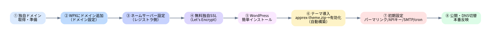

# 🌐 APPREX ドメイン設置・公開手順（WPX / エックスサーバー系）

> WPX（wpX レンタルサーバー / wpX Speed / 現行のエックスサーバー WordPress）に独自ドメインを設置し、本テーマ `apprex` を公開するまでの手順。
>
> ⚠️ 製品・時期により管理画面のメニュー名は多少異なります。**実際のボタン名・表示値（ネームサーバー等）は管理画面の表示を正**としてください。



---

## 0. 事前に用意するもの

- WPX（エックスサーバー）の契約・サーバーアカウント
- 独自ドメイン（例：`apprex.jp`）— Xserverドメイン等で取得済み、または他社管理
- 本テーマのパッケージ `apprex-theme.zip`
- （任意）OpenRouter APIキー、SMTP情報

---

## 1. 独自ドメインの準備

- ドメイン未取得の場合は取得（Xserverドメイン／お名前.com 等）。
- 既に Cloudflare Pages で運用中のドメインを移す場合は、**切替前に DNS の TTL を短く**しておくと切替がスムーズです（§7参照）。

## 2. WPX にドメインを追加（ドメイン設定）

1. サーバーパネルにログイン。
2. **「ドメイン設定」→「ドメイン設定追加」** で独自ドメインを入力して追加。
3. 「無料独自SSLを利用する」にチェックがあれば付けて追加（後からでも可・§4）。

## 3. ネームサーバー（DNS）の設定

ドメインを **WPX/エックスサーバーのネームサーバー**に向けます（ドメインを取得したレジストラの管理画面で設定）。

| 系統 | ネームサーバー（例） |
|------|----------------------|
| エックスサーバー | `ns1.xserver.jp` 〜 `ns5.xserver.jp` |
| wpX 系 | `ns1.wpx.ne.jp` 〜 `ns3.wpx.ne.jp` |

> 必ず**契約中サーバーの管理画面に表示されている値**を使用してください。反映には数時間〜最大48時間かかります。
> Xserverドメインで取得した場合はネームサーバーが自動設定されることが多く、この手順は不要な場合があります。

## 4. 無料独自SSL（https化）

1. サーバーパネル **「SSL設定」→ 対象ドメイン →「独自SSL設定追加（無料Let's Encrypt）」**。
2. 反映まで最大1時間ほど。`https://ドメイン/` で鍵マークが付けばOK。
3. WordPress 側のURLは後の §6 で `https://` に統一します。

## 5. WordPress のインストール

1. サーバーパネル **「WordPress簡単インストール」→ 対象ドメインを選択 →「WordPressインストール」**。
2. サイト名・ユーザー名・パスワード・メールアドレスを入力（**WordPressアドレス/サイトアドレスは `https://ドメイン`**）。
3. インストール後、管理画面 `https://ドメイン/wp-admin/` にログイン。

> wpX Speed 等、WordPress特化プランは契約時点で WordPress 導入済みの場合があります。その場合は §6 へ。

## 6. テーマ `apprex` の導入

1. 管理画面 **外観 > テーマ > 新規追加 > テーマのアップロード**。
2. `apprex-theme.zip` を選択して「今すぐインストール」→「有効化」。
3. 有効化と同時に、固定ページ・静的フロントページ・メニュー・導入事例が**自動生成**されます。
4. **設定 > パーマリンク**を開いて一度「変更を保存」（`/cases/` などのURLを確実化）。
5. **設定 > 一般**で WordPress/サイトアドレスが `https://ドメイン` になっているか確認。

## 7. （移行の場合）Cloudflare からの切替

1. **先に WPX 上でサイトを完成**させる（テーマ導入・表示確認）。動作確認はサーバーパネルの確認用URLや hosts でのプレビューを利用。
2. 問題なければ §3 のネームサーバー切替を実施 → 反映後、本番URLで表示確認。
3. 旧URL（`*.html`）からの主要リダイレクトが必要なら、`.htaccess` で 301 を設定（例：`/contact.html → /contact/`）。
4. ドメインでメール（独自メールアドレス）を使っている場合は、**MXレコード/メール設定の移行**も忘れずに。
5. Google Search Console の所有権確認ファイル（`googleb...html`）が必要なら別途設置。

## 8. 公開後の必須設定

### 8.1 OpenRouter（AIチャット・AI記事生成）
- **設定 > APPREX チャット**でAPIキー・モデルを入力、または `wp-config.php` に定数で設定（推奨）。
  - WPXでの `wp-config.php` 編集は、サーバーパネルの **「ファイルマネージャ」** か FTP/SFTP で、ドメインの公開ディレクトリ直下のファイルを編集。
  ```php
  define( 'APPREX_OPENROUTER_API_KEY', 'sk-or-xxxxxxxx' );
  define( 'APPREX_OPENROUTER_MODEL', 'anthropic/claude-3.5-haiku' );
  ```

### 8.2 連携設定
- **設定 > APPREX 連携**で LINE URL・通知先メール・資料DL URL・ステップメール有効化を設定。

### 8.3 メール送信（SMTP）
- 到達率向上のため **SMTPプラグイン**（WP Mail SMTP 等）を設定推奨。

### 8.4 cron（ステップメール／リマインダーの確実な配信）
本テーマの自動メールは wp-cron で動きます。アクセスが少ないと遅延するため、**サーバーの本物のcron**を推奨：

1. `wp-config.php` に追記：
   ```php
   define( 'DISABLE_WP_CRON', true );
   ```
2. サーバーパネル **「Cron設定」** で1時間ごとに実行を追加（例）：
   ```
   /usr/bin/php /home/【サーバーID】/【ドメイン】/public_html/wp-cron.php >/dev/null 2>&1
   ```
   ※ PHPパス・公開ディレクトリのパスは契約環境の表示に合わせてください。

## 9. 最終チェック

- [ ] `https://ドメイン/` がSSL付きで表示される
- [ ] 主要ページ（/features /pricing /cases /estimate /contact など）が表示
- [ ] フォーム送信 → 自動返信メールが届く（迷惑メールも確認）
- [ ] チャットが応答する（APIキー設定後）
- [ ] スマホ表示・リンク切れ確認、PageSpeed計測

---

## 参考：このサイトの全体像
- `APPREX_使用定義書.md`（仕様）
- `APPREX_運用マニュアル.md`（日常運用）
- `APPREX_ユーザーフロー.png` / `APPREX_マインドマップ.png`（図解）
- テーマ内 `README.md`（導入の最短手順）

> 公式ドキュメント（エックスサーバー／wpX）の最新手順も併せてご確認ください。管理画面のUIが更新されている場合は、本書の流れに沿って読み替えてください。
