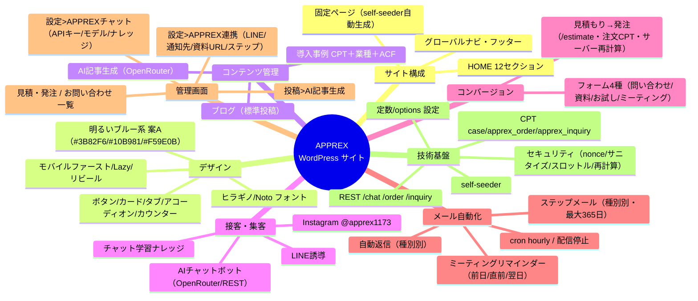

# APPREX サイト マインドマップ

画像版：`assets/APPREX_マインドマップ.png`（編集元 dot は履歴参照）。
以下は GitHub 等でも表示・編集できる Mermaid 版。

```mermaid
mindmap
  root((APPREX<br/>WordPress サイト))
    サイト構成
      固定ページ（self-seeder自動生成）
      HOME 12セクション
      グローバルナビ・フッター
    デザイン
      明るいブルー系 案A（#3B82F6/#10B981/#F59E0B）
      ヒラギノ/Noto フォント
      ボタン/カード/タブ/アコーディオン/カウンター
      モバイルファースト/Lazy/リビール
    コンテンツ管理
      導入事例 CPT＋業種＋ACF
      ブログ（標準投稿）
      AI記事生成（OpenRouter）
    接客・集客
      AIチャットボット（OpenRouter/REST）
      チャット学習ナレッジ
      LINE誘導
      Instagram @apprex1173
    コンバージョン
      見積もり→発注（/estimate・注文CPT・サーバー再計算）
      フォーム4種（問い合わせ/資料/お試し/ミーティング）
    メール自動化
      自動返信（種別別）
      ステップメール（種別別・最大365日）
      ミーティングリマインダー（前日/直前/翌日）
      cron hourly / 配信停止
    管理画面
      設定>APPREXチャット（APIキー/モデル/ナレッジ）
      設定>APPREX連携（LINE/通知先/資料URL/ステップ）
      見積・発注 / お問い合わせ 一覧
      投稿>AI記事生成
    技術基盤
      REST /chat /order /inquiry
      CPT case/apprex_order/apprex_inquiry
      定数/options 設定
      self-seeder
      セキュリティ（nonce/サニタイズ/スロットル/再計算）
```
