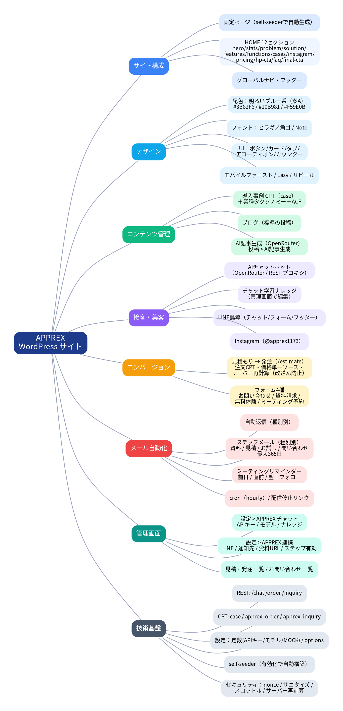

# 📐 APPREX WordPress サイト 使用定義書（現状仕様）

> クラウド型アプリ開発プラットフォーム「APPREX」（合同会社アイズ）公式サイトの WordPress 実装について、現時点の機能・データ・連携の定義をまとめたもの。

最終更新：2026-06-09 ／ 対象：テーマ `apprex` v1.0.0



---

## 1. 概要・目的

- 現行の静的サイト（Cloudflare Pages）を WordPress 化し、**集客・接客・見積〜発注・育成（メール）**まで一気通貫で行えるオウンドメディア兼営業基盤とする。
- Elementor Pro 等の有料プラグインに依存しない**自作テーマ**として実装。プラグイン無しでフォーム／チャット／メール自動化まで完結。

## 2. 動作環境・前提

| 項目 | 内容 |
|------|------|
| WordPress | 6.0 以上（検証 6.7.1） |
| PHP | 7.4 以上（検証 8.4） |
| 必須プラグイン | なし |
| 推奨プラグイン | ACF（事例フィールドUI）／メール到達のための SMTP プラグイン |
| 外部API | OpenRouter（AIチャット・AI記事生成）※APIキー設定時のみ |
| 検証DB | SQLite（本番は MySQL 想定） |

## 3. サイト構成

### 3.1 固定ページ（有効化時に self-seeder が自動生成）

| ページ | スラッグ | テンプレート |
|--------|---------|-------------|
| ホーム | `home` | front-page.php |
| 特徴 | `features` | page-features |
| 機能説明 | `functions` | page-functions |
| 料金プラン | `pricing` | page-pricing |
| よくある質問 | `faq` | page-faq |
| 無料体験申し込み | `free-trial` | page-free-trial |
| お問い合わせ | `contact` | page-contact |
| 見積もり・発注 | `estimate` | page-estimate |
| 資料請求 | `document` | page-document |
| ミーティング予約 | `meeting` | page-meeting |
| ホームページ制作 | `hp-creation` | page-hp-creation |
| 会社概要 | `company` | page-company |

### 3.2 HOME セクション構成（12）

`hero → stats → problem → solution → features → functions → cases → instagram → pricing → hp-cta → faq → final-cta`

### 3.3 導入事例

カスタム投稿タイプ `case`（アーカイブ `/cases`）＋タクソノミー `industry`。アプリ画面サンプルを初期5件として自動登録。

## 4. デザインシステム

- **配色**：明るいブルー系（案A）`--color-primary #3B82F6` / `--color-secondary #10B981` / `--color-accent #F59E0B` / 背景 `#F0F9FF`。
- **フォント**：ヒラギノ角ゴ ProN → Noto Sans JP フォールバック。
- **コンポーネント**：ボタン（primary/accent/ghost/light/secondary）、カード、タブ、FAQアコーディオン、数値カウンター、料金表。
- **方針**：モバイルファースト、画像 Lazy Load、スクロールリビール、`prefers-reduced-motion` 対応。

## 5. 機能モジュール定義

### 5.1 AI チャットボット（接客）
- 全ページ右下に常駐。ブラウザは APIキーに触れず、WP REST `(/apprex/v1/chat)` 経由で OpenRouter にサーバープロキシ。
- システムプロンプトに**料金・サービス・会社情報＋管理画面のナレッジ**を自動注入。
- クイック返信（料金/見積/作れるアプリ）、見積・ミーティング・LINE への導線。
- 未設定時は Zapier iframe にフォールバック。ローカルは `APPREX_CHAT_MOCK` でモック応答。

### 5.2 チャット学習（ナレッジ）
- 設定 > APPREX チャット の「ナレッジ」欄に記載した内容を system prompt 末尾に注入＝随時“学習”。

### 5.3 AI 記事生成
- 投稿 > AI記事生成。テーマ／SEOキーワード／トーン／文字数を指定し、OpenRouter で記事を生成 → 下書き（または公開）保存。`TITLE:` 行を解析し本文は許可タグのみ。

### 5.4 見積もり → 発注
- `/estimate` で サービス→プラン→オプションを選択 → リアルタイム概算。
- 価格は**単一ソース**（`apprex_pricing_config()`）。発注時はサーバーで再計算（改ざん防止）し注文 `apprex_order` を作成、管理者通知＋顧客へ見積明細つき自動返信、`estimate` シーケンスに登録。

### 5.5 ネイティブフォーム（4種）
- お問い合わせ / 資料請求 / 無料体験 / ミーティング予約。REST `(/apprex/v1/inquiry)` 送信、`apprex_inquiry` に保存。同意チェック・LINE誘導つき。ミーティングは希望日時（datetime-local）入力。

### 5.6 自動返信 ＋ ステップ／リマインダー（育成）
- 申込直後に**種別別**の自動返信。
- 以降 wp-cron（hourly）で**種別別シーケンス**を配信：

| 種別 | 配信 |
|------|------|
| 資料請求 | 1 / 3 / 7 / 14 / 30 日 |
| 見積もり・発注 | 1 / 3 / 7 / 14 / 30 日 |
| 30日お試し | 1 / 3 / 7 / 14 / 25 / 30 日（終了前リマインド含む） |
| お問い合わせ | 1 / 3 / 7 / 14 / 30 / 90 / 180 / 365 日 |
| ミーティング予約 | 予約日時基準：前日・直前・翌日フォロー |

- 各メールに配信停止リンク（トークン付き）。文面は `apprex_step_mails` / `apprex_meeting_reminders` フィルタで編集可。

### 5.7 LINE誘導
- 設定 > APPREX 連携 の LINE URL を設定すると、チャット・各フォーム・フッターに「LINEで相談」CTA を表示。

### 5.8 ワンクリック構築（self-seeder）
- テーマ有効化で固定ページ・静的フロント・メニュー・導入事例を自動生成（冪等）。`APPREX_DISABLE_SEEDER` で無効化可。

## 6. データモデル

### 6.1 カスタム投稿タイプ
| CPT | 用途 | 主なメタ |
|-----|------|---------|
| `case` | 導入事例（公開） | case_industry / case_metric_1 / case_metric_2 / case_duration / case_features |
| `apprex_order` | 見積・発注（非公開・status `apprex_new`） | apprex_estimate / apprex_customer_* / drip_* |
| `apprex_inquiry` | フォーム送信（非公開） | apprex_type / apprex_name / apprex_email / apprex_phone / apprex_message / apprex_meeting_at / drip_* |

### 6.2 ドリップ共通メタ（両CPT）
`apprex_drip_active` / `apprex_drip_type` / `apprex_drip_start` / `apprex_drip_sent` / `apprex_email` / `apprex_name` / `apprex_meeting_at`

### 6.3 オプション
`apprex_openrouter_api_key` / `apprex_openrouter_model` / `apprex_chat_knowledge` / `apprex_line_url` / `apprex_notify_email` / `apprex_document_url` / `apprex_drip_enabled`

## 7. REST API（namespace `apprex/v1`）

| エンドポイント | メソッド | 用途 | 保護 |
|---------------|---------|------|------|
| `/chat` | POST | AIチャット応答 | nonce＋IPスロットル（20/分） |
| `/order` | POST | 見積発注の確定 | nonce＋サーバー再計算 |
| `/inquiry` | POST | 各フォーム送信 | nonce＋バリデーション |

すべて `X-WP-Nonce`（wp_rest）必須。入力は sanitize、履歴・文字数に上限。

## 8. cron / メール

- イベント `apprex_dripmail_cron`（hourly）→ `apprex_process_dripmail()` が両CPTの配信対象を走査。
- メール送信は `wp_mail`（本番は SMTP プラグイン推奨）。テーマ切替時に cron を解除。

## 9. 設定（wp-config.php 定数 ／ 優先）

```php
define( 'APPREX_OPENROUTER_API_KEY', 'sk-or-xxxx' ); // AI機能を有効化
define( 'APPREX_OPENROUTER_MODEL', 'anthropic/claude-3.5-haiku' ); // 任意
define( 'APPREX_CHAT_MOCK', true );      // ローカル検証用（APIを使わない）
define( 'APPREX_DISABLE_SEEDER', true ); // 自動構築を止める場合
```

## 10. セキュリティ

- APIキーはサーバー側のみ（ブラウザ非露出）。REST は nonce 検証・入力サニタイズ・チャットIPスロットル。発注金額はクライアント値を信用せずサーバー再計算。配信停止はハッシュトークン照合。

## 11. ファイル構成（抜粋）

```
apprex/
├── inc/
│   ├── installer.php        self-seeder
│   ├── cpt-cases.php        導入事例 CPT
│   ├── acf-fields.php       事例フィールド
│   ├── pricing-config.php   価格 単一ソース＋見積計算
│   ├── openrouter-chat.php  AIチャット REST＋設定＋ナレッジ
│   ├── ai-blog.php          AI記事生成
│   ├── orders.php           見積→発注（注文CPT/通知/自動返信）
│   ├── forms.php            フォーム/自動返信/ステップ/リマインダー/LINE/cron
│   ├── enqueue.php / template-helpers.php
├── page-templates/         下層ページ 9 種
├── template-parts/         HOME各セクション・chatbot・各種パーツ
└── assets/js/              main / chat / estimate / forms
```

## 12. 検証状況（ローカル WP 6.7.1 / SQLite）

- 全ページ HTTP 200、PHP/JS リント通過、致命的エラーなし。
- REST `/chat`（mock）・`/order`（再計算 ¥57,800）・`/inquiry`（4種）動作確認。
- ドリップ：document/trial/estimate=steps[1,3,7]、meeting=前日/直前 を確認。
- self-seeder：クリーンDBで固定ページ・事例・メニュー自動生成を確認。

## 13. 未確定・今後の候補

- 正式な問い合わせメールアドレスの確定（`info@aisjaltd.com` / `info@apprex.jp`）。
- backapp/pasta-app 参考デザインの精密反映（サンドボックスからは閲覧不可）。
- 本物ブログ記事（ノーコード開発ガイド）の取り込み／AI量産。
- ミーティングのカレンダー・Web会議連携（接続URL自動発行）。
- メール文面の御社トーン調整、配信ダッシュボード強化。
