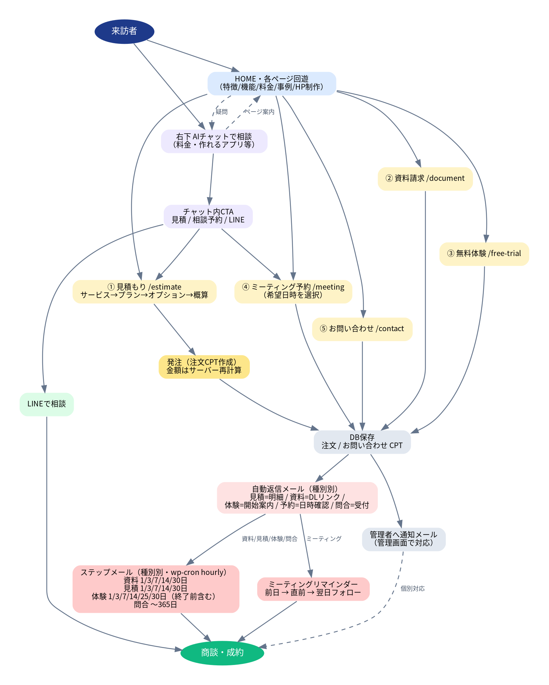

# 🛠 APPREX サイト 運用マニュアル（管理者向け）

> WordPress 管理画面での日常運用手順。対象：テーマ `apprex` 導入済みのサイト管理者。

## ユーザー操作フロー（全体像）



来訪 → HOME回遊／AIチャット → 各CV（見積→発注／資料／体験／予約／問合せ・LINE）→ DB保存＋管理者通知＋種別別の自動返信 → ステップメール／リマインダー → 商談・成約。

---

## 1. 初期セットアップ（最初の1回）

1. **外観 > テーマ > 新規追加 > アップロード** で `apprex-theme.zip` を入れて「有効化」。
   - 有効化と同時に固定ページ・静的フロントページ・メニュー・導入事例が自動生成されます。
2. **設定 > パーマリンク** を開いて一度「変更を保存」（`/cases/` 等のURLを確実化）。
3. **設定 > 表示設定** で「ホームページの表示＝固定ページ／ホーム」になっているか確認。
4. メール到達のため **SMTP プラグイン**（例：WP Mail SMTP）を設定（推奨）。

## 2. OpenRouter（AIチャット・AI記事生成）設定

- 推奨：`wp-config.php` に定数で設定（安全）。
  ```php
  define( 'APPREX_OPENROUTER_API_KEY', 'sk-or-xxxxxxxx' );
  define( 'APPREX_OPENROUTER_MODEL', 'anthropic/claude-3.5-haiku' ); // 任意
  ```
- または **設定 > APPREX チャット** で APIキー・モデルを入力。
- キー未設定の間は、従来の Zapier チャットにフォールバックします。

## 3. チャットの「学習」（ナレッジ更新）

- **設定 > APPREX チャット > ナレッジ** に、覚えさせたい自社情報・FAQ・キャンペーン・対応業種・注意事項を自由記述 → 保存。
- 記載内容はチャットボットが**最優先で参照**します。情報が変わったら都度ここを更新＝学習。

## 4. 連携設定（LINE・通知先・資料）

**設定 > APPREX 連携** で設定：

| 項目 | 効果 |
|------|------|
| LINE 公式アカウント URL | チャット・各フォーム・フッターに「LINEで相談」ボタン表示 |
| 通知先メール | フォーム/発注の管理者通知の宛先（未入力なら管理者メール） |
| 資料ダウンロード URL | 資料請求の自動返信に記載されるDLリンク |
| ステップメール 有効 | 自動フォローメールのON/OFF |

## 5. 導入事例の追加・編集

1. 左メニュー **導入事例 > 新規追加**。
2. タイトル・本文（課題解決プロセス）を入力。
3. 右側「導入事例 詳細」（ACFまたは簡易メタボックス）に **業種／成果指標1・2／開発期間／利用機能** を入力。
4. **アイキャッチ画像**（アプリ画面・WebP推奨）を設定。
5. 公開。HOMEの事例セクションと `/cases` に自動反映されます。

## 6. ブログ運用（AI記事生成）

1. **投稿 > AI記事生成**。
2. テーマ・SEOキーワード・トーン・文字数を指定 → 「AIで記事を生成」。
3. **下書き**として保存されます（公開チェックで即公開）。
4. **必ず内容・事実関係を確認・加筆**してから公開してください。

## 7. 料金の変更

- 表示・見積計算・チャット回答すべての基準は **単一ソース**：`wp-content/themes/apprex/inc/pricing-config.php` の `apprex_pricing_config()`。
- ここを編集すると、見積もりフォーム・チャットの料金回答が自動で揃います。
- 料金「ページ」の文章的な表記は `template-parts/pricing-table.php`／`page-hp-creation.php`。
- ※ コード編集を伴うため、変更時は制作担当へ依頼を推奨。

## 8. 見積・発注の確認

- 左メニュー **見積・発注**：発注一覧（顧客名・金額）。
- 各レコードを開くと「見積・発注 詳細」に顧客情報・見積明細を表示。
- 新規発注時は通知先メールにも明細が届きます。顧客へは見積明細つき自動返信が送信済み。

## 9. お問い合わせ・ステップメール状況

- 左メニュー **お問い合わせ**：全フォーム送信（種別・顧客・内容）。
- 詳細画面で **予約日時**（ミーティング）や **ステップ/リマインダーの送信状況**（種別・送信済み）を確認できます。
- 顧客はメール内の「配信停止」リンクでいつでも停止できます。

## 10. メール文面のカスタマイズ（任意・コード）

`functions.php` 等の最後に以下のフィルタを追加して上書きできます。

```php
// ステップメール（種別: document/trial/estimate/contact）
add_filter( 'apprex_step_mails', function ( $steps, $type ) {
    if ( 'document' === $type ) {
        $steps[3]['subject'] = '【APPREX】資料の活用ポイント';
        $steps[3]['body']    = "{name} 様\n\n…本文…\n";
    }
    return $steps;
}, 10, 2 );

// ミーティングのリマインダー
add_filter( 'apprex_meeting_reminders', function ( $r ) {
    $r['before_1d']['subject'] = '【APPREX】明日のご面談について';
    return $r;
} );

// 申込直後の自動返信
add_filter( 'apprex_autoreply_body', function ( $body, $type, $fields ) {
    return $body;
}, 10, 3 );
```

## 11. メール送信について

- 送信は WordPress 標準の `wp_mail`。**本番では SMTP プラグインの設定を強く推奨**（到達率向上・迷惑メール回避）。
- ステップ／リマインダーは **wp-cron（1時間ごと）** で配信。アクセスが極端に少ないサイトは、サーバーの本物の cron で `wp-cron.php` を定期実行すると確実です。

## 12. 日常運用チェックリスト

- [ ] 新規の **見積・発注／お問い合わせ** を確認し対応
- [ ] 導入事例・ブログを定期更新（AI生成→加筆→公開）
- [ ] キャンペーン内容が変わったら **チャットのナレッジ** と料金設定を更新
- [ ] 月1で **メール到達**（自分宛にテスト送信）を確認

## 13. トラブルシューティング

| 症状 | 対処 |
|------|------|
| チャットが「準備中」と出る | OpenRouter APIキー未設定。設定 > APPREX チャット または wp-config の定数を確認 |
| `/cases` 等が404 | 設定 > パーマリンクを一度保存 |
| メールが届かない | SMTPプラグインを設定。迷惑メールフォルダも確認 |
| ステップメールが送られない | 設定 > APPREX 連携 の「ステップメール有効」ON、サイトに定期アクセス（またはサーバーcron）があるか |
| 料金がフォームとページで食い違う | `pricing-config.php` を正とし、表示テンプレートを合わせる |

---

関連資料：`APPREX_使用定義書.md`（仕様）／`APPREX_マインドマップ.png`（全体像）／テーマ内 `README.md`（導入手順）。
