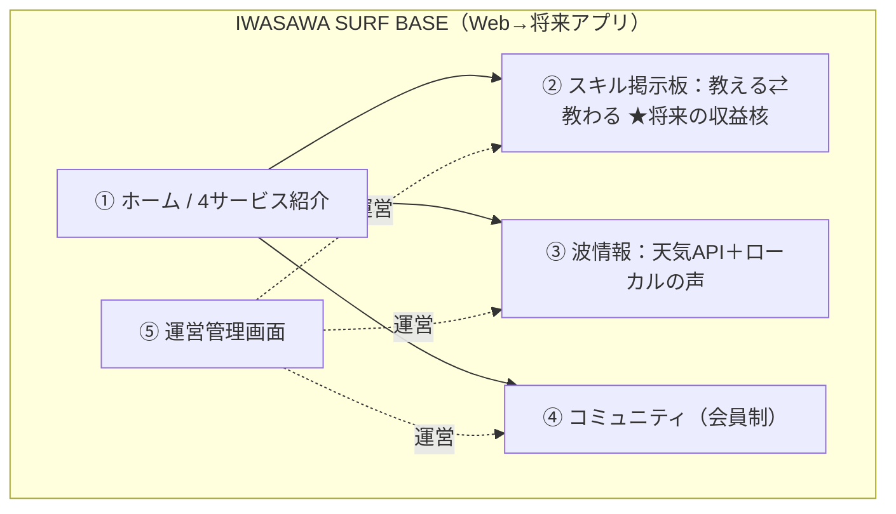
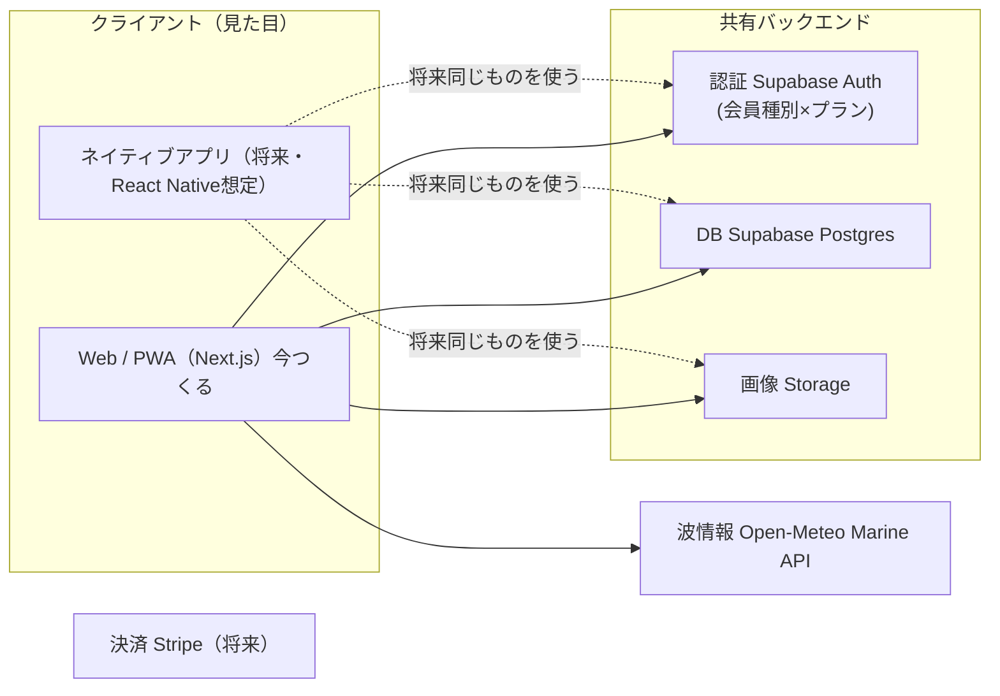
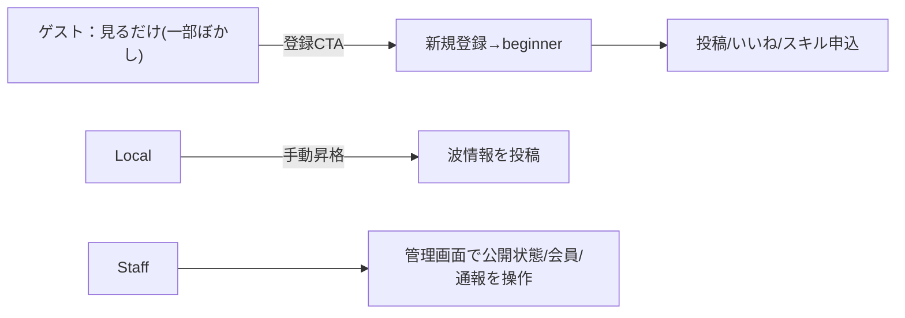

# 🌊 IWASAWA SURF BASE 開発仕様書 v2.0

> 「福島の波を、もっと近くに。」
> 学べる / 借りられる / 移動できる / 案内してもらえる をひとつにする、
> 福島県双葉郡広野町・岩沢海岸エリアの **海体験 × スキル共有 プラットフォーム**。

最終更新：2026-06-07 ｜ 本書がプロジェクトの正（Single Source of Truth）

**変更履歴**
- v2.0 … スキル掲示板・波情報API・収益3本柱・会員2軸(種別×プラン)・アプリ(将来ネイティブ)前提を追加
- v1.0 … 会員制コミュニティ＋管理画面の初版

---

## 0. 30秒サマリ（まずこれだけ）

- **誰に**：福島の海に関わりたい人（初心者・県外客・地元サーファー）
- **何を**：学べて・借りられて・移動できて・案内され、さらに **スキルを教え合える** 場
- **どう稼ぐ（将来）**：①スキル手数料 ②広告バナー ③有料会員。**一般ユーザーからは取らない**（＝関係人口化）
- **今つくるもの**：まず全部 **無料** で動く土台。課金は後で足せるよう“仕込み”だけ入れる
- **アプリ**：Webで作り、将来ネイティブアプリが同じ中身を使える設計にする



---

## 1. システム概要

| 項目 | 内容 |
|------|------|
| プロジェクト名 | IWASAWA SURF BASE |
| 拠点 | 福島県双葉郡広野町・岩沢海岸エリア |
| ブランドの核 | 「福島の波を、もっと近くに。」 |
| 事業の本質 | 学べる/借りられる/移動できる/案内される＋**スキルを教え合える**プラットフォーム |
| KGI志向 | 観光ではなく「関係人口化」 |
| 中核サービス | スクール / レンタル / 移動サポート / ローカルガイド ＋ **スキル掲示板** |
| 収益（将来） | ①スキル手数料 ②広告バナー ③有料会員（一般ユーザーは無料） |
| 今回のゴール | 全機能を**無料で**動かす土台づくり（収益は仕込みのみ） |
| アプリ方針 | Web（PWA）→ 将来ネイティブ。中身（API/DB）を共有して二度手間を防ぐ |

### 世界観・トーン
未来志向 / 海の透明感 / ローカルの温度感 / 復興と再接続。
洗練されつつ冷たくない、ローカルの信頼感、**閉じた排他感は出さない**。

---

## 2. 技術構成（将来ネイティブ前提の“API-first”）



| レイヤー | 採用 | 役割・狙い |
|---------|------|-----------|
| フロント(今) | Next.js + TypeScript + Tailwind | Web/PWA。スマホ最適・表現力 |
| フロント(将来) | React Native 想定 | 同じSupabaseを使い回せる＝二度手間回避 |
| 認証 | Supabase Auth | メール/PW＋LINE Login（段階） |
| DB | Supabase(PostgreSQL) | RLSで権限をDB層でも担保 |
| 画像 | Supabase Storage | 投稿・アバター・スキル画像 |
| 波情報 | **Open-Meteo Marine API** | 無料・キー不要・波高/周期/向き |
| 決済 | Stripe等PSP（将来） | カード情報を自社保持しない |
| プッシュ通知 | PWA/将来ネイティブ | 「いい波アラート」等の土台 |

**設計原則**
- 画面だけで権限を隠さない（**UI＋API＋RLS の三重化**）。
- ビジネスロジックはWebに固定せず、API/DB側に寄せる（将来アプリが同じ動きをするため）。
- 収益機能は“**口だけ用意**”：テーブルとフラグは入れ、課金処理は後で差すだけにする。

---

## 3. 会員モデル（★重要：2軸に分ける）

会員を **「種別(役割)」×「プラン(課金)」** の独立した2軸で持つ。混ぜない。

```
会員 = 種別(role) × プラン(plan)
 例) Local × free / Beginner × premium / Staff × free
```

### 軸①：種別（role）＝何ができるか
| 種別 | 役割 | 権限 | 付与 |
|------|------|------|------|
| Visitor | 閲覧中心(ゲスト) | 一部閲覧のみ | 既定(未登録) |
| Beginner | 質問・体験共有 | 投稿/いいね/コメント/スキル申込/イベント申込 | 登録時の既定 |
| Local | 波情報・ローカル知見 | ＋waves投稿・信頼バッジ・スキル出品強め | 運営が手動付与 |
| Staff/Admin | 運営 | 全権＋管理画面 | 運営が付与 |

### 軸②：プラン（plan）＝どこまで快適か（将来課金）
| プラン | 今(MVP) | 将来の特典(例) |
|--------|---------|----------------|
| free | 全機能使える | 波情報=当日まで／広告あり |
| premium | （未提供） | **いい波プッシュ通知＋7日予報**／優先予約／スキル手数料割引／現地特典／広告非表示 |

> MVPでは全員 free 扱い。`plan` カラムだけ持たせ、premium 特典の出し分けは後で実装。

### 権限マトリクス（ゲスト閲覧範囲の制御）
| 操作 | Visitor | Beginner | Local | Staff/Admin |
|------|:--:|:--:|:--:|:--:|
| フィード/掲示板 閲覧 | ⭕(一部ぼかし) | ⭕ | ⭕ | ⭕ |
| 投稿詳細 | ⭕(最新数件) | ⭕ | ⭕ | ⭕ |
| いいね/コメント | ❌ | ⭕ | ⭕ | ⭕ |
| 投稿作成(質問/体験) | ❌ | ⭕ | ⭕ | ⭕ |
| 波情報(waves)投稿 | ❌ | ❌ | ⭕ | ⭕ |
| スキル出品 | ❌ | ⭕ | ⭕ | ⭕ |
| スキル申込 | ❌ | ⭕ | ⭕ | ⭕ |
| 管理画面 | ❌ | ❌ | ❌ | ⭕ |

> ゲートは「壁」でなく「招待」。ぼかし＋やわらかいCTA＋最短のLINE/登録導線で、初心者・県外客が怖くならないように。

---

## 4. サイト全体構成

```
A. ホーム（入口/4サービス紹介）
B. スキル掲示板（教える⇄教わる）★将来の収益核
C. 波情報（API＋ローカル投稿）
D. コミュニティ（会員制）
E. 管理画面（非公開・運用寄り）
F. ショップ（無在庫・法務必須／Phase後半）
横断基盤：Auth / Member(種別×プラン) / LINE導線
```

---

## 5. 画面仕様

### 5-A. ホーム
Hero / Concept（福島の波を、もっと近くに。）/ 4サービス / Plan / Area / Usage Flow / About / FAQ / Contact / Shop・Community・**スキル掲示板への導線** / LINE CTA。
配色：Deep Navy・Ocean Blue・Sand Beige。スクロールで自然につながる体験。

### 5-B. スキル掲示板（新規・中核）
**目的**：「教えたい人」と「教わりたい人」をつなぐ。学べる/ローカルガイドの発展形。

| # | 画面 | ルート | アクセス | 概要 |
|---|------|--------|---------|------|
| SK-01 | スキル一覧 | `/skills` | ゲスト可(制限) | カテゴリ(スクール/修理/写真/ガイド…)・検索 |
| SK-02 | スキル詳細 | `/skills/:id` | ゲスト可 | 内容・提供者・料金(将来)・申込ボタン |
| SK-03 | スキル出品/編集 | `/skills/new` | 会員(beginner+) | タイトル・カテゴリ・説明・画像・料金(将来) |
| SK-04 | 申込/問い合わせ | `/skills/:id/apply` | 会員 | **MVPは連絡だけ**。決済は将来Stripeで差す |
| SK-05 | 自分の出品/申込 | `/me/skills` | 会員 | 出した/申し込んだ一覧 |

> **段階設計**：MVPは「掲示板＋連絡」まで（無料）。Phase2で `skill_orders` に決済＋手数料を載せる。

### 5-C. 波情報
**目的**：客観データ（API）＋主観（ローカルの声）で「今日入れる？」に答える。

| # | 画面/要素 | ルート | 概要 |
|---|-----------|--------|------|
| WV-01 | 波情報ウィジェット | `/`,`/community` 内 | Open-Meteoから波高/周期/風/気温を表示 |
| WV-02 | 波情報ページ | `/waves` | 今日〜数日の予報＋ローカル投稿(waves)を時系列で |
| WV-03 | ローカル波報告 | `/community/new`(waves) | role≥local が「今日の雰囲気」を投稿 |

データ取得：Open-Meteo Marine API（岩沢海岸の緯度経度を固定）。取得結果は短時間キャッシュ。
将来：premium に「いい波プッシュ通知＋7日予報」。

### 5-D. コミュニティ（会員制／既存を継承）
既存構成（Hero/コンセプト帯/フィード/カテゴリ/投稿フォーム/波情報/イベント/メンバー紹介/利用者の声/LINE CTA）を維持し、認証ゲートとマイページを重ねる。
カテゴリ：`waves / experiences / questions / events / gear`

| # | 画面 | ルート | アクセス |
|---|------|--------|---------|
| C-01 | フィード | `/community` | ゲスト可(制限) |
| C-02 | 投稿詳細 | `/community/posts/:id` | ゲスト可(コメントは会員) |
| C-04 | ログイン | `/login` | 未認証 |
| C-05 | 新規登録 | `/signup` | 未認証(既定 beginner) |
| C-06 | パスワード再設定 | `/password/reset` | 未認証 |
| C-07 | 投稿作成/編集 | `/community/new` | 会員 |
| C-08 | マイプロフィール | `/me` | 会員 |
| C-09 | 自分の投稿 | `/me/posts` | 会員 |
| C-13 | イベント詳細/申込 | `/community/events/:id` | 閲覧ゲスト可/申込会員 |

### 5-E. 管理画面（非公開・運用寄り／装飾控えめ）
| # | 画面 | ルート | 主要操作 |
|---|------|--------|---------|
| AD-00 | 管理ゲート | `/admin/login` | Staff/Admin のみ |
| AD-01 | ダッシュボード | `/admin` | 会員数/新規/今日の投稿/イベント/承認待ち/人気カテゴリ |
| AD-02 | 投稿管理 | `/admin/posts` | 公開/非公開/注目/カテゴリ変更/削除/通報確認 |
| AD-03 | イベント管理 | `/admin/events` | 作成/編集/受付切替/定員/表示順 |
| AD-04 | 会員管理 | `/admin/members` | 種別変更/状態(有効/停止)/権限付与/履歴 |
| AD-05 | お知らせ管理 | `/admin/announcements` | 作成/公開/掲載先 |
| AD-06 | 通報/要確認 | `/admin/reports` | 一覧→非公開/対応 |
| AD-07 | スキル管理(将来) | `/admin/skills` | 出品の承認/非公開/通報 |
| AD-08 | 広告枠管理(将来) | `/admin/ads` | バナー枠の販売・掲載 |
| AD-09 | 注文管理(将来) | `/admin/orders` | 無在庫フロー運用 |

### 主要フロー


---

## 6. データベース設計

> 全テーブル共通：`id uuid PK / created_at / updated_at`。

### コア
- **members**：email / handle / display_name / bio / avatar_url / **role**(visitor|beginner|local|staff|admin) / **plan**(free|premium) / status(active|suspended) / line_user_id / home_area / last_login_at
- **posts**：author_id / category(waves|experiences|questions|events|gear) / title / body / status(draft|published|hidden) / is_featured / view_count / like_count
- **post_images**：post_id / url / sort_order
- **comments**：post_id / author_id / body / status(published|hidden)
- **likes**：member_id / post_id ／ unique(member_id, post_id)
- **events**：title / description / location / starts_at / ends_at / capacity / entry_status(upcoming|open|closed|finished) / sort_order / created_by
- **event_entries**：event_id / member_id / status(applied|confirmed|cancelled|attended) ／ unique(event_id, member_id)
- **reports**：target_type(post|comment|skill) / target_id / reporter_id / reason / status(open|reviewing|resolved|dismissed) / handled_by
- **announcements**：title / body / placement(top|shop|community|all) / is_published / published_at
- **navigation_items**：surface(top|shop|community|skills) / label / href / kind(banner|cta|link) / is_active / sort_order
- **admin_audit_logs**：actor_id / action / target_type / target_id / meta(jsonb)
- **waves_reports**：author_id(local+) / observed_at / wave_height / wind / condition / spot

### スキル掲示板（新規）
- **skills**：owner_id(FK→members) / category(school|repair|photo|guide|other) / title / description / price(int,**MVPはnull可**) / status(open|closed|hidden) / is_featured
- **skill_images**：skill_id / url / sort_order
- **skill_applications**：skill_id / applicant_id / message / status(applied|accepted|declined|done) ／ MVPは「連絡のみ」。`order_id`列を将来用に空けておく

### 収益“仕込み”（テーブルだけ先置き・MVDは未使用）
- **skill_orders(将来)**：skill_id / buyer_id / amount / fee(手数料) / psp_ref / status(pending|paid|refunded)
- **ad_banners(将来)**：advertiser / image_url / href / surface / start_at / end_at / is_active
- **subscriptions(将来)**：member_id / plan / psp_ref / status / current_period_end

### 波情報キャッシュ（任意）
- **wave_cache**：spot / fetched_at / payload(jsonb)  ※Open-Meteoの取得結果を短時間保持

### RLS方針（要点）
- posts/skills の published はゲスト読取可（アプリ層でゲストは最新数件＋ぼかし）。draft/hidden は本人かstaff。
- likes/comments/skill_applications の作成は beginner+。waves投稿は local+。
- 管理系(reports/announcements/navigation/audit/skills承認)はstaff/adminのみ。

---

## 7. デザイン仕様

カラートークン：Deep Navy `#0B2540` / Ocean Blue `#1E6F9F` / Teal `#2BB8A3` / Sand Beige `#E9DEC9` / White。
キーワード：透明感・奥行き・静かな高揚感・波の流れ・朝の海・ローカルの安心感・復興後の前向きさ。
避ける：量販ECの安売り感／古い観光サイト感／派手な南国テンプレ／閉鎖的なローカル排他感。
面のトーン：公開面=感性寄り（演出・余白）。管理面=運用寄り（密度高・バッジ/タグ・装飾控えめ）。LINE CTAはモバイルで常駐。

### コピー例（世界観を“実物”に）
- Hero：「**福島の波を、もっと近くに。** 初めてでも、また来たくなる海へ。」
- 登録CTA：「**続きは、仲間になってから。** 30秒で登録して、岩沢の今日を覗こう。」
- ゲートのぼかし：「ここから先はメンバーの声です。登録すると全部読めます🌊」
- スキル掲示板：「**できる人が、これからの人へ。** あなたのスキルを、海の入口にしよう。」
- 波情報：「今日は腰〜胸、風は弱オフ。**地元のひと言**：朝イチがメローでおすすめ。」

---

## 8. 法務・運用（ショップ／スキル決済が動く時）

ショップ・将来のスキル決済は日本のEC法務を意識。
必須表示：販売価格 / 送料 / 追加費用 / 支払方法と時期 / 引渡時期 / 返品・キャンセル条件 / 事業者情報 / 問い合わせ先。
注意：**無在庫を誤解させない**／**即納表現禁止・納期は具体**／返品条件は見つけやすく／カード情報は自社保持しない(PSP)／法務文言はUIに自然に組み込む。
※ スキル取引に手数料を載せる時は、取引条件・キャンセル規定・運営の立場（仲介）を明記。

---

## 9. MVPスコープ（今回作る範囲）

### 作る（全部無料）
- 認証：C-04/05/06、members(**role＋plan列を持つが全員free扱い**)
- 権限ゲート：UI＋API＋RLS
- コミュニティ：C-01/02/07/08/09、いいね
- スキル掲示板：SK-01/02/03/05 ＋ SK-04は**連絡のみ**（決済なし）
- 波情報：WV-01/02（Open-Meteo連携）＋ WV-03（local投稿）
- 管理：AD-00/01/02/04/06（通報は最小）

### 作らない（仕込みのみ＝テーブルとフラグだけ）
- スキル決済・手数料（skill_orders）／広告枠（ad_banners）／有料会員(subscriptions・premium特典)
- ショップ実装／イベント申込フロー／プッシュ通知／ネイティブアプリ本体／導線管理の動的化

### 完了条件（Done）
1. ゲストは一部閲覧でき、登録すると beginner として投稿・いいね・スキル申込(連絡)ができる
2. 波情報がAPIで表示され、Localが「今日の雰囲気」を投稿できる
3. Staff/Admin が投稿・会員・通報を管理できる
4. 課金は無いが、後で差せるテーブル/フラグ(plan, price, skill_orders…)が用意されている
5. 世界観・LINE CTA・法務前提が崩れていない

---

## 10. 開発ロードマップ（道順）

「土台 → 入口 → 中身 → 運営」。各ステップは動作確認してから次へ。

| Step | 内容 | 対象 | 状況 |
|------|------|------|------|
| 0 | リポジトリ初期化(Next.js+Supabase)・デザイントークン・PWA下地 | - | ⬜ |
| 1 | 認証＋members(role×plan) | C-04/05/06 | ⬜ |
| 2 | 権限ゲート(共通化・RLS) | 横断 | ⬜ |
| 3 | ホーム＋コミュニティ・フィード | 5-A / C-01 | ⬜ |
| 4 | 投稿の中身(詳細/作成/いいね) | C-02/07 | ⬜ |
| 5 | マイページ | C-08/09 | ⬜ |
| 6 | 波情報(API＋local投稿) | WV-01/02/03 | ⬜ |
| 7 | スキル掲示板(連絡まで) | SK-01〜05 | ⬜ |
| 8 | 管理ゲート＋ダッシュボード | AD-00/01 | ⬜ |
| 9 | 投稿管理/会員管理/通報 | AD-02/04/06 | ⬜ |
| 10 | (将来)決済・広告・有料会員・ネイティブ | 仕込み→実装 | ⬜ |

推奨スプリント：**①②(認証＋権限)** → **③〜⑦(公開機能)** → **⑧⑨(運営)** → **⑩(収益・アプリ)**。

---

## 11. 引き継ぎ・開発前提

1. 既存「IWASAWA SURF BASE」構想の延長で進化（作り変えない）。世界観・導線・運用思想・法務前提を維持。
2. 開発は1ステップずつ、動作確認後に次へ。
3. 権限は UI＋API＋RLS の三重化。
4. **会員は 種別×プラン の2軸**で持つ（混ぜない）。
5. **API-first**でロジックをバックに寄せ、将来ネイティブが同じ中身を使える形に。
6. 収益機能は“仕込み”を先に：テーブル/フラグだけ用意し、課金処理は後で差す。
7. 一般ユーザーからは取らない（関係人口化）。取るのはスキル利用・広告・有料会員のみ。
8. 波情報＝Open-Meteo(客観)＋ローカル投稿(主観)の二段構成。
9. 出力は毎回「目的/既存構成との関係/画面構成/主要機能/必要データ定義/UI・UXポイント/次フェーズ拡張案」の形式で。

---

_前身：v1.0、および初回設計メモ(00_初回設計_全体再整理とMVP.md)。以後は本書(v2.0)を正とする。_
