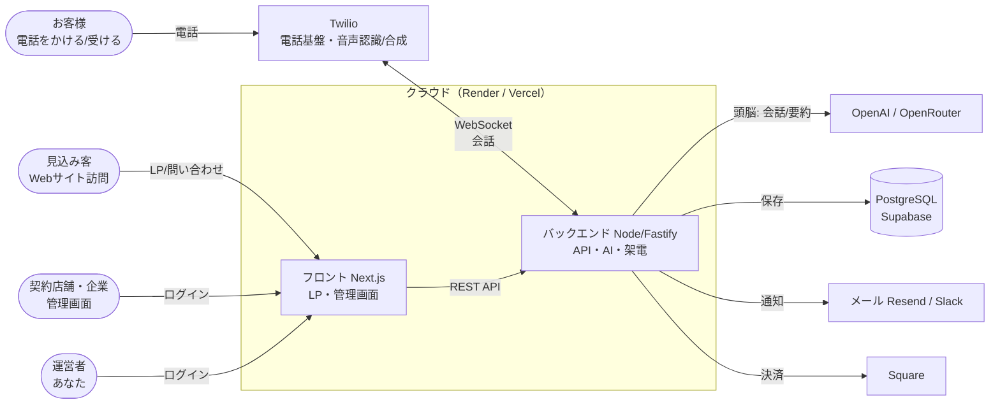
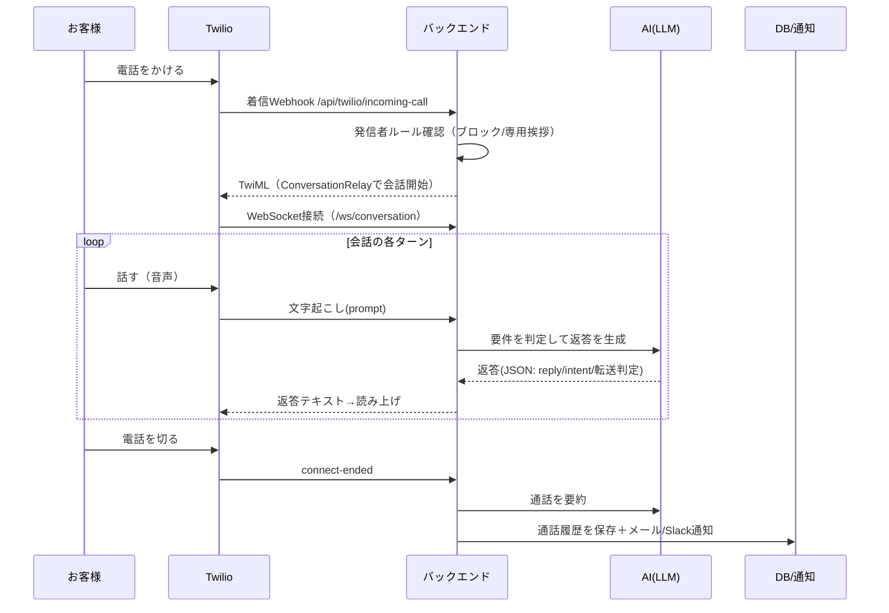
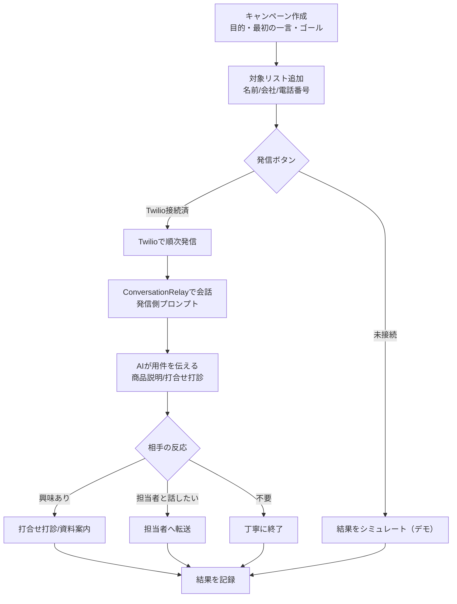
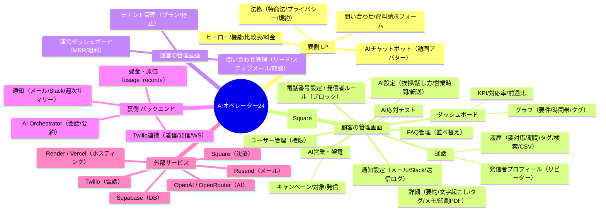

# 全体構造：フロー & マインドマップ（AIオペレーター24）

このドキュメントは、システム全体の構造・データの流れを図で示します。
（GitHub上では下記のMermaid図がそのまま図として表示されます）

---

## 1. システム全体図（誰が・何を・どこで）



- **電話の核**：Twilio が音声を扱い、バックエンドの AI が「何を話すか」を決める。
- **頭脳だけ**が OpenAI/OpenRouter。音声認識・読み上げは Twilio 側。
- DB・通知・決済・LLM は **キーを入れた分だけ本物**になる（未接続はデモ動作）。

---

## 2. 着信フロー（お客様 → AIが応答）



判定例：予約／問い合わせ（FAQ回答）／折り返し受付／担当者へ転送／クレームは人へ。

---

## 3. AI営業・架電フロー（こちらから電話）



---

## 4. マインドマップ（機能の全体像）



---

## 5. ディレクトリ構造（コードの置き場所）

```
backend/src/
  server.ts          … 起動・ルート登録・ワーカー
  twilio/            … 着信/発信Webhook・署名検証・TwiML
  ws/                … 通話のWebSocket（会話の入口）
  ai/                … Orchestrator・プロンプト・要約・LLM
  outbound/          … AI架電（キャンペーン・発信）
  leads/             … 問い合わせ導線・チャットボット
  billing/           … 料金/原価・Square
  notify/            … メール/Slack/週次サマリー
  db/                … DBアクセス・クエリ
  demo/              … デモ用データ

frontend/app/
  page.tsx           … LP
  contact/           … 問い合わせフォーム
  legal/             … 法務ページ
  (app)/             … 管理画面（ダッシュボード/通話/AI営業/設定…）
```

---

## 6. 一言まとめ

- **電話を受ける（着信）**と**電話をかける（架電）**の両方を、AIが会話して処理する。
- **管理画面**は「顧客（店舗）用」と「運営（あなた）用」で内容が切り替わる。
- **外部サービスのキーを入れた分だけ本物**になり、未接続でも全画面をデモで触れる。
