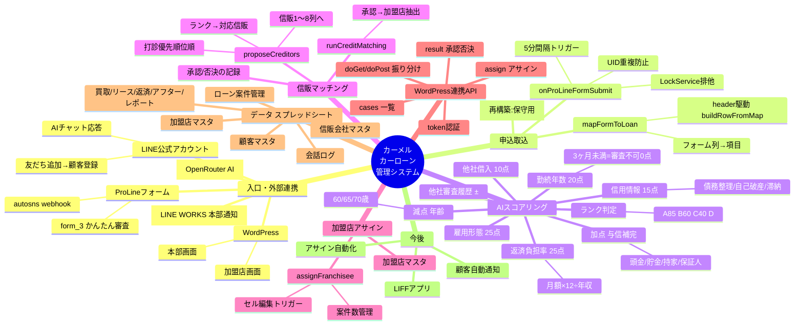

# カーメル カーローン管理システム ― 使用定義書（マインドマップ）

> 対象リポジトリ: `AISCAMEL/-` / ブランチ: `claude/nifty-tesla-5dfbjy`
> 構成: Google Apps Script（GAS）＋ Google スプレッドシート ＋ LINE ＋ WordPress

---

## 1. 全体マインドマップ（Mermaid）



---

## 2. 処理の流れ（パイプライン）

```
[LINE/フォーム] → 申込取込 → AIスコア/ランク → 信販マッチング
   → (本部/加盟店が承認・否決) → 加盟店アサイン → (顧客通知)
        ✅完成        ✅完成        ✅完成            ✅API完成 / WP画面設置中     ⬜今後
```

---

## 3. ファイル（GAS）と役割

| ファイル | 役割 |
|---|---|
| `Config.gs` | 全設定（LINE/OpenRouter/APIトークン/スプレッドID/スコア基準/各種日数） |
| `Main.gs` | LINE webhook（doPost/doGet）、AI応答、顧客登録、会話ログ、WP API振り分け |
| `FormHandler.gs` | フォーム取込、項目マッピング、案件登録、再構築(rebuildLoanSheet) |
| `Scoring.gs` | スコア計算、正規化、年齢算出、ランク判定 |
| `CreditMatch.gs` | 信販提案(proposeCreditors)、承認後の加盟店抽出、加盟店アサイン |
| `WebApi.gs` | WordPress連携API（cases/result/assign、token認証） |
| `Setup.gs` | 各シートのヘッダー定義（setupAllSheets） |
| `LineNotify.gs` | LINEプッシュ送信 |
| `OpenRouter.gs` | AI応答呼び出し |
| `AfterSupport.gs` / `DelayCalc.gs` / `Reminder.gs` / `LineWorks.gs` | アフター/延滞/リマインド/LINE WORKS |
| WordPress `carmel-cases.php` | 本部・加盟店の案件管理画面（ショートコード `[carmel_cases]`） |

---

## 4. スコアリング定義（配点）

| 項目 | 配点 | 備考 |
|---|---|---|
| 雇用形態 | 25 | 正社員/公務員=25 … パート=5 |
| 勤続年数 | 20 | **3ヶ月未満は審査不可（0点）** |
| 返済負担率 | 25 | 月額支払い可能額×12÷年収。≤20%=25 |
| 他社借入 | 10 | なし=10 |
| 他社審査履歴 | ±5〜−10 | 多重申込ほど減点 |
| 信用情報 | 15 | 現在滞納−10、過去/事故は加点なし |
| 加点（与信補完） | + | 頭金+10/貯金+10/持家+8/保証人+10 |
| 年齢減点 | − | 60歳−5 / 65歳−10 / 70歳−15 |
| **ランク** | | **A≥85 / B≥60 / C≥40 / D** |

---

## 5. 信販会社の対応判定 → 提案ロジック

| 申込ランク | 提案される信販（例） |
|---|---|
| A | オリコ / ジャックス / アプラス（低金利） |
| B | ジャックス / アプラス / プレミア |
| C | USSサポート / セイブ系 / カーアシスト ほか |
| D | カラフルライン / 自社リース ほか |

`対応判定` に申込ランクが含まれ、`個人対応`かつ`稼働中`の信販を `打診優先順位` 順に最大8社。

---

## 6. WordPress連携API

| メソッド | action | 用途 |
|---|---|---|
| GET | `cases` | 案件一覧（本部=全件 / 加盟店=自店） |
| POST | `result` | 信販の承認/否決＋承認額を記録 |
| POST | `assign` | 加盟店アサイン |

- 認証: 全リクエストに `token`（`CONFIG.API.TOKEN`）必須
- 設置: WordPress側はサーバー(PHP)から呼ぶ（CORS回避）

---

## 7. 今後のロードマップ

1. **顧客への自動通知**（審査結果をLINEで返信）※LINE ID取得の不具合修正が前提
2. **LIFFアプリ**（申込をLINE内で完結＝データ品質・通知を根本改善）
3. **加盟店アサインの自動化**（承認→候補抽出→自動割当）
